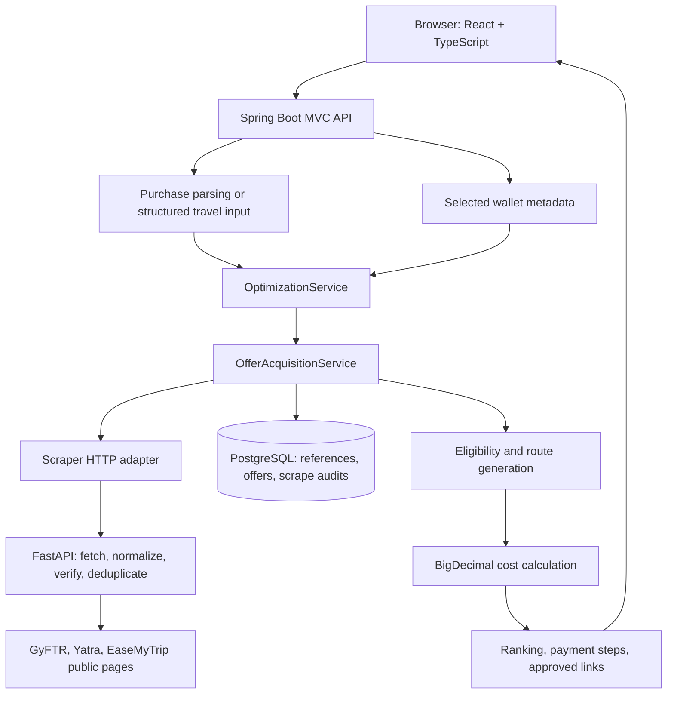
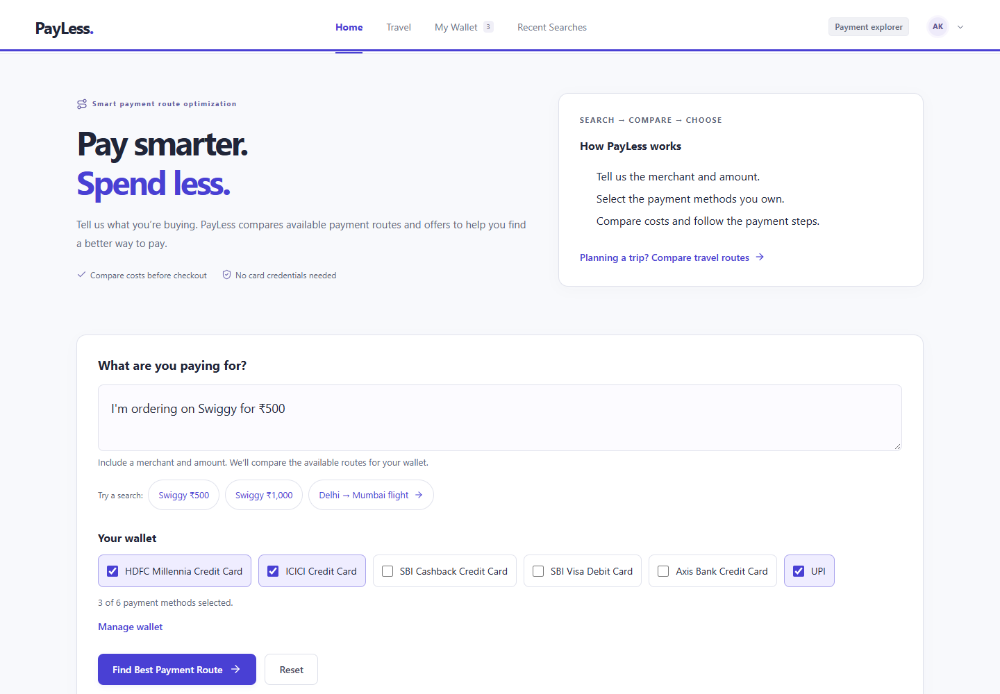
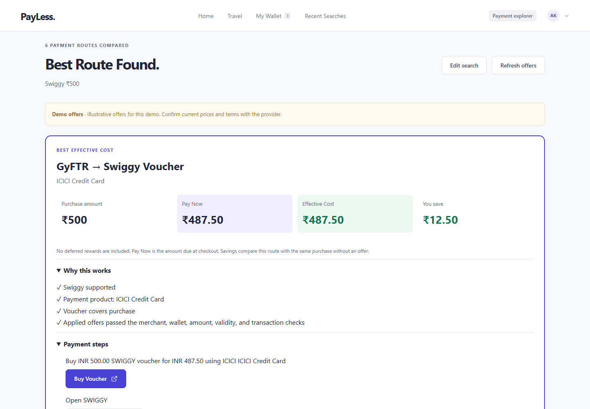

# PayLess

> Find a better way to pay using the payment methods you already own.

PayLess turns a purchase intent such as **“I'm ordering food on Swiggy for ₹500”** into ranked payment routes. It combines selected wallet metadata with offer acquisition, eligibility checks and precise cost calculations to compare direct payment, eligible discounts, cashback and supported vouchers. Recommendations distinguish **what you pay now** from **effective cost after deferred benefits**, and include source information, conditions and checkout steps.

**[GitHub repository](https://github.com/BlackRabbitHere/PayLess)** · **[Run locally](#quick-start-docker-compose)** · **[Screenshots](#screenshots-and-demo)** · **[API examples](#api-overview-and-examples)**

**Implemented scope:** Swiggy via GyFTR, Yatra and EaseMyTrip offer adapters; a complete browser → Spring → scraper → database workflow; and Delhi ↔ Mumbai travel comparisons using labelled demo fares. Docker Compose starts with synthetic offer fixtures for a reproducible demonstration. Live acquisition is a separate configuration, not a guarantee of current offers. No public application URL is recorded in the repository.

## Contents

- [Problem, solution and innovation](#problem-solution-and-innovation)
- [Features and supported providers](#features-and-supported-providers)
- [Architecture and technology](#architecture-and-technology)
- [Repository structure](#repository-structure)
- [Docker quick start](#quick-start-docker-compose)
- [Manual development setup](#manual-development-setup)
- [Environment reference](#environment-reference)
- [Verify your installation](#verify-your-installation)
- [API overview and examples](#api-overview-and-examples)
- [Persistence and migrations](#persistence-and-migrations)
- [Testing and CI](#testing-and-ci)
- [Deployment](#deployment)
- [Security, privacy and offer data](#security-privacy-and-offer-data)
- [Limitations and scalability](#limitations-and-scalability)
- [Screenshots and demo](#screenshots-and-demo)
- [Troubleshooting](#troubleshooting)
- [Development and contributing](#development-and-contributing)

## Problem, solution and innovation

A shopper may own several cards and still pay full price because useful benefits are scattered across banks, merchants, voucher platforms and travel websites. Comparing minimum spends, payment restrictions, voucher denominations and deferred cashback takes time at checkout.

PayLess starts with the purchase and evaluates ways to pay, rather than requiring the user to search an offer catalogue:

```text
Purchase intent → merchant + INR amount
                + selected payment instruments
                + normalized offer data
                → eligibility → candidate routes → cost calculation → ranking
```

What distinguishes the implementation:

- **Intent first:** deterministic text parsing recognizes supported merchants, aliases and bounded spelling corrections, then extracts and validates the amount. No LLM service or API key is required.
- **Wallet aware:** issuer, instrument type and payment channel affect eligibility. The engine also supports network checks, but the current scraper mapping supplies no structured network restrictions. Product names identify the instrument; product-specific reward schedules are not inferred.
- **Comparable economics:** one Java `BigDecimal` calculator handles immediate discounts, caps, priced vouchers and deferred cashback. Separate recommendations minimize effective cost and checkout payment.
- **Multiple routes:** direct-payment baselines compete with eligible offers and explicitly stackable direct-offer combinations. Voucher routes have their own pricing and redemption steps.
- **Explainable results:** rejected eligibility rules, source metadata, fixture labels, warnings and approved continuation links accompany recommendations.
- **Separated acquisition:** Python adapters collect and normalize data; Spring owns purchase eligibility, route generation and authoritative monetary decisions.

### Example journey

1. Open Wallet and select your payment methods. The initial wallet contains sample metadata that you can change.
2. Submit `I'm ordering food on Swiggy for ₹500` on Home.
3. Spring identifies `SWIGGY`, `FOOD_DELIVERY` and `INR 500.00`, requests GyFTR offers, then evaluates routes for the supplied wallet plus a UPI baseline.
4. Compare Pay Now, Effective Cost, potential saving and payment steps; continue through an approved provider link.

**Illustrative fixture example:** the checked-in Swiggy fixture supports a ₹500 voucher priced at ₹487.50. With the HDFC credit-card metadata in the API example below, the fixture smoke test checks a ₹487.50 Pay Now result: ₹12.50 below the original cost. This is a reproducible test scenario, not a promise of a currently redeemable discount. PayLess does not execute payments or bookings.

### Hackathon impact

The prototype demonstrates a reusable purchase-to-payment decision workflow for shoppers, food-delivery users and travellers who otherwise compare offers manually. Showing both immediate payment and deferred benefits helps users understand the trade-off before checkout. Small savings on recurring purchases can add up; no measured user-savings or market-size claim is made.

## Features and supported providers

| Area | Implemented behavior | Code evidence |
| --- | --- | --- |
| Purchase understanding | INR formats, aliases, bounded fuzzy matching; rejects ambiguous, missing, nonpositive and fractional-paise amounts | [Query services](backend/src/main/java/com/paymentoptimizer/query/application/) |
| Wallet | Add, select, remove and restore catalogue instruments; browser-local metadata persistence with Zustand | [Wallet feature](frontend/src/features/wallet/) |
| Acquisition | Public HTTP first; bounded Chromium fallback, cache, normalization, source verification, deduplication and diagnostics | [Scraping service](scraper/src/payment_scraper/services/scraping_service.py) |
| Eligibility | Merchant, issuer, instrument type, network, mode, minimum spend, dates, availability, usage and stacking checks | [OfferEligibilityService](backend/src/main/java/com/paymentoptimizer/offers/application/OfferEligibilityService.java) |
| Routes and cost | Direct payment, eligible instant discounts/coupons/bank offers/cashback and GyFTR → Swiggy vouchers; two-decimal money arithmetic | [Optimization services](backend/src/main/java/com/paymentoptimizer/optimization/application/) |
| Ranking | Effective cost, then Pay Now, verification confidence, complexity and stable ID; separate best-Pay-Now selection | [PaymentRouteOptimizer](backend/src/main/java/com/paymentoptimizer/optimization/application/PaymentRouteOptimizer.java) |
| Travel | Structured city/date/passenger form; shared optimizer across two demo fares; fare-to-route association | [Travel feature](backend/src/main/java/com/paymentoptimizer/travel/) |
| Reliability | Timeouts, request cancellation, partial-source diagnostics, direct-payment fallback, correlation IDs and controlled errors | [HTTP client](frontend/src/shared/api/httpClient.ts), [OptimizationService](backend/src/main/java/com/paymentoptimizer/optimization/application/OptimizationService.java) |

The [provider registry](scraper/src/payment_scraper/providers/registry.py) and Spring [provider catalogue](backend/src/main/java/com/paymentoptimizer/offers/application/OfferProviderCatalog.java) implement these paths:

| Adapter | Merchant | Configured live source scope |
| --- | --- | --- |
| `GYFTR` | `SWIGGY` | Public Swiggy voucher page |
| `YATRA` | `YATRA` | Curated RBL card offer page |
| `EASEMYTRIP` | `EASEMYTRIP` | Curated hotel promotion page |

These adapters have fixtures, parser tests and saved live captures; they do not cover every offer on each site. [Dated scraper verification](scraper/docs/verification.md) records prior live checks, not current availability. Merchants in legacy frontend demo data or redirect lists are not additional integrations.

Travel fares come from [DemoFareProvider](backend/src/main/java/com/paymentoptimizer/travel/application/DemoFareProvider.java), not a live airline/search API. The form accepts six cities, but only **Delhi ↔ Mumbai**, today or a future date, and **1–6 passengers** produce demo fares. Other valid city pairs return unsupported-route guidance. Provider terms can describe hotels or specific trip categories; the optimizer does not fully model these travel restrictions.

## Architecture and technology



The browser calls **Spring only**, never FastAPI or PostgreSQL. In Compose, nginx serves the frontend and proxies `/api/` to Spring. Standalone Vite calls the configured Spring origin. Acquisition happens on demand; PostgreSQL records observations and audits, while the optimizer does not use it as a read-through offer cache.

| Layer | Repository versions / implementation |
| --- | --- |
| Frontend | React 19.3.0, TypeScript 5.9.3, Vite 7.3.6, Tailwind CSS 4.3.3, Zustand 5.0.15, React Router 7.18.4, native `fetch` (versions from [npm lockfile](frontend/package-lock.json)) |
| Backend | Java 21, Spring Boot 3.5.5, MVC, Validation, Data JPA, Actuator, PostgreSQL JDBC and Flyway ([POM](backend/pom.xml)) |
| Scraper | Python ≥3.12, FastAPI, Pydantic, Requests, Beautiful Soup/lxml, Playwright and Uvicorn; ranges in [pyproject.toml](scraper/pyproject.toml), exact hashed dependencies in [requirements.lock](scraper/requirements.lock) |
| Build/runtime | Maven Wrapper 3.9.9, Node 22 in Docker/CI, PostgreSQL 17 in Compose, Docker Compose and nginx |
| Verification | JUnit/Spring tests, ArchUnit, Node tests, Vitest, Playwright, pytest and GitHub Actions |

## Repository structure

```text
PayLess/
├── frontend/                    React app, npm lockfile, Dockerfile, netlify.toml
│   └── src/features/            Query, wallet, optimization, travel and redirects
├── backend/                     Maven Wrapper, Spring API and Dockerfile
│   └── src/main/resources/      Spring profiles and db/migration/ SQL
├── scraper/                     Python package, Dockerfile and configuration example
│   ├── src/payment_scraper/     API, provider adapters and acquisition core
│   ├── tests/fixtures/          Synthetic and captured-live regression fixtures
│   ├── contracts/              Canonical schema and saved offer examples
│   └── docs/                   Source access and API documentation
├── data/                        Saved Spring contract fixtures and freeze manifests
├── scripts/                     Startup helper, fixture smoke and boundary checks
├── docs/                        Architecture, historical verification and screenshots
├── .github/workflows/ci.yml     Fixture-based CI
├── .env.example                 Optional root Compose overrides
├── docker-compose.yml          Full local stack and optional smoke service
└── README.md
```

## Quick start: Docker Compose

**Prerequisites:** Git, Docker Desktop or Docker Engine with the Compose plugin, a running Docker daemon, and access to download images/dependencies. Host Java, Node and Python are not needed. Run commands from the repository root.

```bash
git clone https://github.com/BlackRabbitHere/PayLess.git
cd PayLess
cp .env.example .env
```

On PowerShell, use `Copy-Item .env.example .env`. Edit `.env` and choose your own `DATABASE_PASSWORD`; retain the fixture and port settings for this walkthrough. The file is optional for Compose itself, but makes your local configuration explicit. Do not commit it.

```bash
docker compose up -d --build --wait
docker compose ps
docker compose --profile smoke run --rm smoke
```

Open **[PayLess at localhost:4173](http://localhost:4173)**. The first build installs dependencies and Chromium. Compose creates PostgreSQL and waits for healthy dependencies; Spring applies Flyway migrations automatically.

| Service | Compose access | Standalone/manual access |
| --- | --- | --- |
| Frontend | `http://localhost:4173` → nginx container port `5173` | `http://localhost:4173` → Vite |
| Spring API | Internal `http://backend:8080`; browser uses `http://localhost:4173/api/...` | `http://localhost:8080` |
| FastAPI | Internal `http://scraper:8000`; not published on the host | `http://127.0.0.1:8000` |
| PostgreSQL | `localhost:15432` → container `5432` | Same with Compose database; native PostgreSQL may use `5432` |

Only frontend and PostgreSQL are published, both on loopback. `/actuator/health` and FastAPI `/health` are **not** proxied by nginx. `FRONTEND_PORT` and `POSTGRES_PORT` change the published ports. Ordinary `docker compose down` preserves named database and scraper-data volumes; `down -v` deletes them.

**Default data mode:** the scraper mounts `scraper/tests/fixtures` and labels results `FIXTURE`. Spring's Docker environment explicitly permits fixtures. Ordinary smoke tests need no live provider requests; live fetch failures never trigger an automatic fixture fallback.

### Opt into live acquisition

For intentional live testing, change root `.env`:

```dotenv
SCRAPER_FIXTURE_DIR=
SCRAPER_ALLOW_FIXTURES=false
PLAYWRIGHT_ENABLED=true
```

Rerun `docker compose up -d --build --wait`. Read [source-access policy](scraper/docs/source-access.md) first. `TERMS_REVIEWED_PROVIDERS` is optional audit metadata, not an activation gate or proof of permission. Live requests may time out or return unavailable/ineligible offers; the fixture smoke command intentionally rejects live mode. Travel fares remain demo data.

Root Compose supplies its own scraper environment and does **not** load `scraper/.env`. Provider flags and other settings not passed by Compose require an explicit Compose override to affect containers.

## Manual development setup

### Prerequisites and startup order

- **JDK 21** with `JAVA_HOME` configured. Use the checked-in Maven Wrapper; no separate Maven installation is needed.
- **Node.js 22** (Docker/CI version) and its bundled npm. npm has no repository-pinned version; install with `npm ci`.
- **Python 3.12 or newer** with `venv` and pip; CI and Docker use 3.12.
- **PostgreSQL 17** for Compose parity, locally installed or Docker-hosted.
- Git and four terminals. Start **PostgreSQL → scraper → Spring → frontend**: Spring needs the database on startup; offer requests also need the scraper.

Clone as above. Each numbered step starts from the repository root in a separate terminal. Commands use Bash unless labelled PowerShell. When switching from the full Compose stack, run `docker compose stop frontend backend scraper` and retain PostgreSQL; Vite and the Compose frontend cannot both occupy port 4173.

### 1. PostgreSQL

Use root `.env` with your chosen password:

```bash
docker compose up -d --wait postgres
docker compose exec -T postgres pg_isready -U payment_optimizer -d payment_optimizer
```

Compose creates the `payment_optimizer` database and role at `localhost:15432`. For native PostgreSQL, create a login role and database named `payment_optimizer` using your database administration tool, choose a password, and adjust the JDBC port. **Do not create application tables manually.**

Changing `.env` after a volume has been initialized does not change the existing PostgreSQL role password. Spring must use the actual database credentials.

### 2. FastAPI scraper

```bash
cd scraper
python3.12 -m venv .venv
source .venv/bin/activate
python -m pip install --require-hashes -r requirements.lock
python -m pip install --no-deps -e .
cp .env.example .env
```

PowerShell equivalents:

```powershell
cd scraper
py -3.12 -m venv .venv
.\.venv\Scripts\Activate.ps1
python -m pip install --require-hashes -r requirements.lock
python -m pip install --no-deps -e .
Copy-Item .env.example .env
```

For reproducible local results, edit these values in `scraper/.env` while retaining the other example settings:

```dotenv
APP_ENV=development
FIXTURE_DIR=tests/fixtures
PLAYWRIGHT_ENABLED=false
SAVE_RAW_HTML=false
```

From `scraper/`, with the virtual environment active:

```bash
python -m uvicorn payment_scraper.api.app:app --host 127.0.0.1 --port 8000 --reload
```

Check [health](http://127.0.0.1:8000/health) and [Swagger UI](http://127.0.0.1:8000/docs). Health should report `mode: fixture`. Relative `FIXTURE_DIR`/`DATA_DIR` paths resolve from the scraper working directory; shell variables override `.env`.

For live mode, leave `FIXTURE_DIR=` empty, set `PLAYWRIGHT_ENABLED=true` if using fallback, and install Chromium in this environment:

```bash
python -m playwright install chromium
```

On Linux needing browser OS packages, use `python -m playwright install --with-deps chromium`. HTTP is preferred; browser fallback uses more time and memory. The Docker image already installs Chromium and OS dependencies. Keep one Uvicorn worker for the current process-local cache and pacing.

Windows also has `./scripts/start-scraper.ps1 -Profile local -Fixture` from the repository root after environment installation. It binds `127.0.0.1:8000`, disables browser/raw capture for fixtures and uses `data/runtime/scraper`. `SCRAPER_PYTHON` can select an existing Python executable for this helper only.

### 3. Spring Boot

Spring does **not** automatically read root `.env`. Export your PostgreSQL password in the backend terminal; replace the placeholder with the same password chosen above.

```bash
cd backend
export SPRING_PROFILES_ACTIVE=local
export DATABASE_URL=jdbc:postgresql://localhost:15432/payment_optimizer
export DATABASE_USERNAME=payment_optimizer
export DATABASE_PASSWORD='<your-local-database-password>'
export SCRAPER_BASE_URL=http://127.0.0.1:8000
./mvnw spring-boot:run
```

PowerShell:

```powershell
cd backend
$env:SPRING_PROFILES_ACTIVE = 'local'
$env:DATABASE_URL = 'jdbc:postgresql://localhost:15432/payment_optimizer'
$env:DATABASE_USERNAME = 'payment_optimizer'
$env:DATABASE_PASSWORD = '<your-local-database-password>'
$env:SCRAPER_BASE_URL = 'http://127.0.0.1:8000'
.\mvnw.cmd spring-boot:run
```

Default profile `local` permits fixtures. The API listens on 8080 unless `PORT` is set. Verify [Actuator health](http://localhost:8080/actuator/health) and [system status](http://localhost:8080/api/v1/system/status). No scraper service token is required or implemented in this checkout.

### 4. React frontend

```bash
cd frontend
npm ci
cp .env.example .env.local
npm run dev
```

PowerShell uses `Copy-Item .env.example .env.local`. The copied file contains:

```dotenv
VITE_API_BASE_URL=http://localhost:8080
```

Open [localhost:4173](http://localhost:4173). Vite uses a strict port and will not silently choose another. Restart it after environment changes. All `VITE_*` values are public browser configuration; never put credentials or tokens there.

## Environment reference

Examples: [root Compose](.env.example), [frontend](frontend/.env.example), [scraper](scraper/.env.example). There is no backend `.env.example`; Spring uses process variables and checked-in YAML profiles.

### Frontend

| Variable | Required / example | Purpose |
| --- | --- | --- |
| `VITE_API_BASE_URL` | Required; `http://localhost:8080` manually, explicitly empty behind Compose nginx | Spring API origin: absolute HTTP(S) or empty for same-origin. No Vite API proxy is configured. |
| `VITE_APP_PROFILE` | Optional; `local` | Profile label; falls back to Vite mode. |

Use `.env.local` for machine overrides. Do not rely on another machine's ignored `.env.development`, `.env.test`, `.env.docker` or `.env.production`. External build variables override file values. `npm run build` uses production mode; `build:docker` uses Docker mode.

### Backend and root Compose

| Variable | Requirement / value | Purpose |
| --- | --- | --- |
| `SPRING_PROFILES_ACTIVE` | Optional locally: `local`; production: `production` | Actual profiles: `local`, `docker`, `production`, `test`; no `prod` profile. |
| `DATABASE_URL` | Required in production; local default `jdbc:postgresql://localhost:15432/payment_optimizer` | JDBC URL; container hostname/port is `postgres:5432`. |
| `DATABASE_USERNAME` | Required in production; local role `payment_optimizer` | Database login. |
| `DATABASE_PASSWORD` | Required in production; `<your-database-password>` | Match Compose PostgreSQL and standalone Spring. Local YAML/Compose have development-only defaults. |
| `SCRAPER_BASE_URL` | Required in production; local default `http://127.0.0.1:8000` | Spring-to-FastAPI URL; Docker default `http://scraper:8000`. |
| `SCRAPER_CONNECT_TIMEOUT`, `SCRAPER_READ_TIMEOUT` | Optional; `5s`, `30s` | HTTP time bounds; each must be positive and at most 10 minutes. |
| `CORS_ALLOWED_ORIGINS` | Required in production; `https://<frontend-host>` | Comma-separated exact frontend origins. Local defaults include localhost/127.0.0.1 on 4173 and 5173. |
| `PORT` | Optional; `8080` | Spring listening port. |
| `SCRAPER_ALLOW_FIXTURES` | Compose/Docker switch; root example `true` | Docker resolves this variable. `local` explicitly allows fixtures; `production` rejects them. |
| `SCRAPER_FIXTURE_DIR` | Compose only; `/app/fixtures`, or explicitly empty for live | Passed to FastAPI as `FIXTURE_DIR`. |
| `FRONTEND_PORT` | Compose only; `4173` | Frontend host port; nginx stays on internal 5173. |
| `POSTGRES_PORT` | Compose only; `15432` | Database host port; internal port stays 5432. Update standalone JDBC URL if changed. |

Production requires explicit database, scraper and CORS values. The test profile excludes database/Flyway auto-configuration for ordinary tests. `SCRAPER_SERVICE_TOKEN` and `FRONTEND_ORIGIN` are not implemented keys here.

### Scraper

Every setting has a default; no secret is required to start the scraper. Names come from [Settings](scraper/src/payment_scraper/config/settings.py). Root Compose overrides selected values, including fixture mode, browser use and raw capture.

| Variable(s) | Default | Purpose / scope |
| --- | --- | --- |
| `APP_ENV` | `development` | Use `production` in production; nonempty `FIXTURE_DIR` is rejected then. Compose uses `docker`. |
| `LOG_LEVEL` | `INFO` | Logging level. |
| `SCRAPER_USER_AGENT` | `PaymentRouteOptimizer/0.1 (+public-offer-collection)` | Public HTTP User-Agent. |
| `HTTP_CONNECT_TIMEOUT`, `HTTP_READ_TIMEOUT` | `5`, `25` seconds | Provider HTTP time bounds. |
| `MAX_REDIRECTS`, `MAX_RESPONSE_BYTES` | `3`, `5000000` | Fetch redirect/body limits. |
| `MAX_RETRIES`, `MAX_RETRY_WAIT_SECONDS` | `0`, `30` | HTTP retries disabled by default; at most two configurable retries. Spring adds no retry loop. |
| `DEFAULT_RATE_LIMIT_SECONDS` | `3` | Process-local outbound request pacing, not an incoming API rate limiter. |
| `CACHE_TTL_SECONDS`, `CACHE_MAX_ENTRIES` | `300`, `32` | Bounded in-process HTTP cache. |
| `ROBOTS_CACHE_SECONDS` | `3600` | Informational robots observation cache. |
| `SAVE_RAW_HTML` | `true` | Raw public-page capture; disabled in root Compose. |
| `RAW_HTML_RETENTION_DAYS`, `SNAPSHOT_MAX_FILES` | `7`, `200` | Snapshot retention bounds. |
| `DATA_DIR` | `data` | Writable runtime directory; Compose uses `/app/data` with a named volume. |
| `PLAYWRIGHT_ENABLED` | `true` | Chromium fallback; root Compose defaults to `false`. |
| `PROVIDER_YATRA_ENABLED` | `true` | Enable Yatra. |
| `PROVIDER_GYFTR_ENABLED` | `true` | Enable GyFTR. |
| `PROVIDER_EASEMYTRIP_ENABLED` | `true` | Enable EaseMyTrip. |
| `BROWSER_SELECTOR_TIMEOUT_MS`, `BROWSER_NAVIGATION_TIMEOUT_MS` | `8000`, `30000` | Browser selector/navigation bounds. |
| `BROWSER_MAX_REQUESTS` | `40` | Browser request budget. |
| `TERMS_REVIEWED_PROVIDERS` | Empty | Optional audit list, e.g. `GYFTR,YATRA,EASEMYTRIP`; does not enable providers. |
| `FIXTURE_DIR` | Empty/unset | **Development/test only:** `tests/fixtures` from `scraper/`. Explicit offline data, never production or automatic fallback. |

## Verify your installation

- [ ] PostgreSQL readiness succeeds; Spring logs successful Flyway migration/validation.
- [ ] Scraper `/health` returns `status: ok` and the intended `fixture` or `live` mode.
- [ ] Spring `/actuator/health` returns `UP`; it checks the database, not scraper readiness.
- [ ] `/api/v1/system/status` reports the scraper dependency and mode. HTTP success alone does not mean that dependency is healthy.
- [ ] Home, Wallet and Travel load; Home submits a Swiggy query through Spring.
- [ ] Results expose source/fixture information and checkout steps.
- [ ] Fixture smoke passes in fixture mode.

Inspect internal Compose health:

```bash
docker compose exec -T postgres pg_isready -U payment_optimizer -d payment_optimizer
docker compose exec -T backend curl --fail --silent http://127.0.0.1:8080/actuator/health
docker compose exec -T scraper python -c "import urllib.request; print(urllib.request.urlopen('http://127.0.0.1:8000/health').read().decode())"
docker compose --profile smoke run --rm smoke
```

Alternatively, with host Python installed, run `python scripts/smoke.py http://localhost:4173` from the root against full Compose. It checks frontend delivery, correlation, repeated merchant ingestion, travel and all three fixture providers.

## API overview and examples

### Spring: browser-facing API

| Method and path | Role |
| --- | --- |
| `POST /api/optimize/query` | Parse purchase query and rank routes for wallet metadata. |
| `POST /api/travel/optimize` | Compare supported demo fares through the shared optimizer. |
| `GET /api/v1/system/status` | Backend status and scraper health/mode via Spring. |
| `GET /actuator/health` | Backend/database health; internal-only in Compose. |
| `POST /api/v1/optimization/scraper-check` | Development contract probe; absent under `production`. |
| `POST /api/v1/offers/acquisition-check` | Development acquisition/ingestion diagnostics; absent under `production`. |

**Bash request against Compose** (use `http://localhost:8080` for manual setup):

```bash
curl --fail-with-body http://localhost:4173/api/optimize/query \
  -H 'Content-Type: application/json' \
  --data '{"query":"I am ordering food on Swiggy for INR 500","wallet":[{"issuer":"HDFC","productName":"Millennia","instrumentType":"CREDIT_CARD","network":"VISA"}]}'
```

PowerShell equivalent:

```powershell
$body = @{
    query = 'I am ordering food on Swiggy for INR 500'
    wallet = @(@{ issuer = 'HDFC'; productName = 'Millennia'; instrumentType = 'CREDIT_CARD'; network = 'VISA' })
} | ConvertTo-Json -Depth 4
Invoke-RestMethod -Uri http://localhost:4173/api/optimize/query -Method Post -ContentType 'application/json' -Body $body
```

Responses contain `context`, `currency`, `bestEffectiveCostRoute`, `bestPayNowRoute`, `alternatives`, `eligibility`, `sources` and `warnings`. A route includes `cost`, `paymentInstrument`, `steps` and its own `sources` metadata. Direct routes calculate `payNow = originalAmount - immediateDiscount` and `effectiveCost = payNow - deferredReward`. Voucher selling prices already contain the discount, so it is not counted twice.

`wallet` may be empty/omitted, with at most 20 entries; UPI remains a baseline. Instrument types: `UPI`, `CREDIT_CARD`, `DEBIT_CARD`. Networks: `NONE`, `UNKNOWN`, `VISA`, `MASTERCARD`, `RUPAY`, `AMEX`, `DINERS`. Unknown request fields are rejected. See [OptimizeRequest](backend/src/main/java/com/paymentoptimizer/optimization/dto/OptimizeRequest.java).

Travel accepts `origin`, `destination`, `departureDate` (`YYYY-MM-DD`, today or later), `passengers` and the same `wallet`. See [TravelRequest](backend/src/main/java/com/paymentoptimizer/travel/dto/TravelRequest.java); choose Delhi/Mumbai for a supported demonstration.

### FastAPI: internal acquisition API

| Method and path | Role |
| --- | --- |
| `GET /health` | Process health and fixture/live mode, not a provider success test. |
| `GET /api/v1/providers` | Enabled adapters, merchant support and latest provider observations. |
| `POST /api/v1/scrape` | Single provider/merchant acquisition; body uses `provider`, `merchant`, `forceRefresh`. |
| `GET /api/v1/offers` | Independent provider envelopes; optional `provider`, `merchant`, `force_refresh` query parameters. |
| `GET /api/v1/schema/offers` | Canonical offer JSON Schema. |
| `GET /docs`, `GET /openapi.json` | Swagger UI/OpenAPI, currently enabled in all environments. |

For the standalone scraper:

```bash
curl http://127.0.0.1:8000/health
curl http://127.0.0.1:8000/api/v1/providers
curl --fail-with-body http://127.0.0.1:8000/api/v1/scrape \
  -H 'Content-Type: application/json' \
  --data '{"provider":"GYFTR","merchant":"SWIGGY","forceRefresh":false}'
```

This API is for backend integration/debugging, not frontend calls. Spring has no bundled Swagger UI. See the [scraper contract](scraper/docs/api-contract.md) and [Spring integration notes](scraper/docs/spring-boot-integration.md).

## Persistence and migrations

**Flyway is the schema authority:** Spring connects to PostgreSQL, checks migration history, applies pending migrations, then Hibernate validates (`ddl-auto: validate`). Do not replace this with `ddl-auto=update`.

- [V1](backend/src/main/resources/db/migration/V1__initial_schema.sql) creates `merchant`, `merchant_alias`, `provider`, `offer`, `scraper_run` and seeds the supported catalogue.
- [V2](backend/src/main/resources/db/migration/V2__add_offer_indexes.sql) adds offer/audit lookup indexes.
- Add new versioned SQL under [db/migration](backend/src/main/resources/db/migration/); do not edit already-applied migrations.

The unique `source_external_key` supports atomic PostgreSQL upserts. Older observations and fixtures cannot overwrite newer/live records. Each acquisition attempt gets an audit row, including failures and cached results. Network acquisition finishes before the short offer/audit transaction. Persistence failures return controlled 503 errors rather than silently reporting successful optimization.

## Testing and CI

Run from the indicated directories after dependency installation. Counts are omitted because they change with the source.

```bash
# Repository root: scraper/contract freeze boundary.
python scripts/verify-frozen-scraper.py

# backend/: ordinary saved-response tests; no database/provider network needed.
./mvnw test

# backend/: include PostgreSQL tests and package the app.
# Start Compose postgres and export its DATABASE_* values in this terminal first.
./mvnw -Pdatabase-tests package

# frontend/
npm ci
npm run check
npm run build:docker

# frontend/: requires packaged backend + PostgreSQL; uses saved FastAPI responses.
npx playwright install chrome
npm run test:e2e

# scraper/: activate the installed Python 3.12+ virtual environment first.
python -m pip install 'pytest>=8.3,<10' 'httpx>=0.28,<1'
python -m pytest

# Repository root: fixture stack smoke.
docker compose --profile smoke run --rm smoke
```

Windows uses `.\mvnw.cmd`. `npm run check` runs types, ESLint, model/architecture and React/API/component tests. `npm run build` is the production-mode build: configure `VITE_API_BASE_URL` for its destination first (CI explicitly sets it empty). Scraper pytest excludes live and real-browser tests by default.

Use an isolated PostgreSQL database for `-Pdatabase-tests`; repository tests manage their own rows. [Playwright](frontend/playwright.config.ts) starts a fixture server on 18000, packaged Spring on 18080 and Vite on 15173 (`E2E_PORT` overrides the latter), inheriting database credentials from its terminal. Frontend E2E uses Chrome; scraper fallback uses Chromium, so their installation commands differ.

Opt-in checks: scraper `python -m pytest -m live`, scraper `python -m pytest -m browser`, and backend `./mvnw -Plive-scraper test` with `RUN_LIVE_SCRAPER=true`. Configure provider access and a reachable live scraper before live checks; the backend live checkpoint also needs PostgreSQL and its `DATABASE_*` configuration. Ordinary CI never depends on provider websites.

### GitHub Actions

[Fixture CI](.github/workflows/ci.yml) runs on pushes and pull requests without a branch filter:

```text
Scraper boundary check → isolated PostgreSQL → backend tests/package
→ frontend checks/build → scraper offline tests → desktop/mobile browser flows
→ Compose build and fixture smoke → failure diagnostics → cleanup
```

CI uses Java 21, Node 22 and Python 3.12. It has no deployment job, verified production branch or enforced deployment gate.

## Deployment

The submission context describes **Netlify frontend → Render Spring API → Render FastAPI**, with **Neon PostgreSQL** and GitHub Actions for CI. This checkout substantiates the following pieces; it does not verify remote service settings or current URLs:

| Component | Repository evidence and configuration |
| --- | --- |
| Netlify frontend | [frontend/netlify.toml](frontend/netlify.toml): base `frontend`, `npm run check && npm run build`, publish `dist`, SPA fallback. Ensure Netlify uses this nested config; set public `VITE_API_BASE_URL` to the Spring HTTPS origin at build time. |
| Render Spring service | [backend/Dockerfile](backend/Dockerfile), `PORT` support and `production` profile. Set `DATABASE_*`, `SCRAPER_BASE_URL`, exact `CORS_ALLOWED_ORIGINS`. No `render.yaml` is present. |
| Render scraper service | [scraper/Dockerfile](scraper/Dockerfile), fixed port 8000, one worker and `/health`. Set `APP_ENV=production`, leave fixtures unset and supply writable `DATA_DIR`. No tracked Render settings establish network exposure or persistent disk. |
| Neon PostgreSQL | Generic PostgreSQL/JDBC integration. Use `DATABASE_URL=jdbc:postgresql://<database-host>/<database-name>?sslmode=require`, `DATABASE_USERNAME=<database-user>`, `DATABASE_PASSWORD=<database-password>` from deployment settings. No Neon-specific manifest or `neon.ts` exists. |
| GitHub / CI | Git remote and [workflow](.github/workflows/ci.yml). Hosting auto-deploy settings are outside the repository. |

**Local development uses local/Docker PostgreSQL; Neon is not required.** Netlify's config supplies a SPA rewrite, not a Spring API proxy: an empty API origin there needs additional proxy configuration. Store backend/database secrets in the hosting environment, never Vite variables. TLS termination, access controls and the stated remote topology cannot be audited from these files alone.

## Security, privacy and offer data

### Implemented safeguards

- Wallet requests accept issuer, product name, instrument type and network with validation limits and unknown-field rejection. No card numbers, CVV, PIN, OTP or banking credentials are required.
- Production Spring requires explicit allowed origins and rejects fixtures. Development acquisition probes are absent under `production`.
- Spring emits approved exact HTTPS checkout URLs; the frontend also validates provider hosts and protects external links against opener access.
- Scraper URL policies restrict acquisition; HTTP/browser operations have time, redirect, response-size and request bounds, with configurable outbound pacing.
- Correlation IDs connect browser, Spring, scraper and audit records. Controlled errors avoid exposing raw upstream exception details to the UI.

**Security boundary:** user authentication, backend-to-scraper token authentication and incoming API rate limiting are not implemented. Compose isolates Spring/FastAPI on internal service networking. Public deployment needs appropriate external service access controls; CORS is not authentication. `SCRAPER_SERVICE_TOKEN` does not activate authentication here.

### Data privacy

| Location | Stored or processed data |
| --- | --- |
| Browser localStorage | Wallet product metadata under compatibility key `routewise-wallet-v2`; no payment credentials. |
| Browser session memory | Current API results and recent searches; no account or cross-device sync. |
| Spring requests | Purchase query or travel inputs and wallet metadata during optimization. |
| PostgreSQL | Merchant/provider references, offer payloads and acquisition audits; no user-wallet table or stored request body. |
| Logs / scraper runtime | Request IDs, merchant and purchase amounts, counts/timings, diagnostics, observations and optional raw public-page captures. |

Avoid personal or payment credentials in the free-text query. No payment credentials are needed, but purchase amounts and merchants do appear in operational logs.

### Offer data notice

Offers and pages change; cached observations can become outdated. `VERIFIED` describes source consistency, not guaranteed eligibility for a user or purchase. Confirm current prices, terms, availability and final totals with the provider. Missing/unstructured restrictions may need manual interpretation.

The scraper uses ordinary public HTTP/browser navigation without credentialed scraping, CAPTCHA solving or challenge evasion. Robots observations and terms-review metadata are informational in this implementation, not proof of unrestricted scraping permission. Synthetic and captured-live regression fixtures are offline data, not fresh observations.

## Limitations and scalability

- Only three merchant/provider mappings and a small wallet catalogue are supported. There are no account-specific coupons, bank-account connections or automatic payments/bookings.
- Travel uses demo Delhi ↔ Mumbai fares, without live availability. Eligibility does not fully interpret product rewards, passenger/trip categories, selected properties or all free-text restrictions. The live EaseMyTrip source is a hotel offer, not evidence of flight eligibility.
- Unknown availability and unconfirmed usage rules can exclude verified offers. No-discount results may be correct. UPI availability and wallet accuracy are assumptions; unpriced fees/rewards are not added.
- Vouchers support GyFTR/Swiggy with one priced denomination no larger than the purchase. No arbitrary multi-voucher combination or voucher-plus-card-offer stacking is implemented.
- Scraper cache, pacing and health are process-local; acquisition is serialized under a lock. There is no distributed cache, queue or background refresh scheduler.
- Enumerating stackable direct-offer subsets can grow rapidly with a larger catalogue; expansion needs route-search bounds as well as acquisition capacity.
- Provider failure can still return direct-payment routes and warnings. Database failure can fail optimization because audit persistence is required.
- The approved GyFTR checkout action uses `/swiggy-money`, while current acquisition uses `/swiggy-gv`; fresh source data does not guarantee a useful continuation page.

**Future directions, not shipped features:** distributed caching/coordinated pacing, queued refreshes, bounded route search, richer travel/product eligibility, more adapters/cards, live fares and authenticated wallet sync. Existing `OfferSource`, `OfferStore` and `FareProvider` ports separate these extensions from controllers and presentation.

## Screenshots and demo

Existing captures of the running local application are copied into a stable documentation location. Results show **synthetic demo offers**, not proof of current commercial savings.

| Home / purchase search | Ranked route / payment steps |
| --- | --- |
|  |  |

Judge walkthrough: start Compose, show Home → Wallet → Swiggy results → payment steps, then Travel with Delhi → Mumbai and a future date. `/system` shows backend/scraper status. No public demo-video URL is recorded in the repository.

## Troubleshooting

| Symptom | Checks and resolution |
| --- | --- |
| Backend cannot connect to PostgreSQL | Check `docker compose ps`, `pg_isready`, JDBC URL, username and actual role password. Host port is 15432; container address is `postgres:5432`. Root `.env` is not exported to standalone Spring. Existing volumes retain their original credentials. |
| Flyway/Hibernate validation fails | Inspect startup logs and migration history. Use the intended database and versioned migrations; do not enable `ddl-auto=update` or delete a volume to hide a mismatch. |
| Spring cannot reach scraper | Check `SCRAPER_BASE_URL`: `127.0.0.1:8000` manually, `scraper:8000` inside Compose. Inspect `/health` and `/api/v1/system/status`. Compose does not expose host port 8000; token mismatch is not applicable here. |
| Live offers unavailable | `/health` checks FastAPI; `/api/v1/providers` reports adapter observations. Response `sources`/`warnings` distinguish acquisition failures; `eligibility` explains rejection of acquired offers. Follow correlation IDs in logs. |
| Live requests time out | Spring defaults to 30s read timeout, browser navigation to 30s and frontend timeout to 75s. Raising only Spring's timeout does not extend frontend/nginx limits. Keep live diagnostics separate from fixture smoke. |
| Chromium cannot launch | Activate scraper environment and install Chromium; on Linux install OS dependencies too. Check `PLAYWRIGHT_ENABLED` and filesystem access. Fixtures need no browser. |
| Frontend cannot reach Spring | Check `VITE_API_BASE_URL`, restart/rebuild Vite, check Spring port and CORS. Empty API origin requires an actual `/api/` proxy; Netlify's SPA rewrite is insufficient. |
| Port collision | Inspect Compose mappings and `docker compose ps`. Both Vite and Compose default to host 4173: stop the unused frontend. Change `FRONTEND_PORT`/`POSTGRES_PORT` and dependent URLs/CORS together. Vite can use `npm run dev -- --port 5173 --strictPort`. |
| Smoke rejects live mode | Restore `SCRAPER_FIXTURE_DIR=/app/fixtures` and `SCRAPER_ALLOW_FIXTURES=true`, then recreate affected services. Smoke is fixture-only. |
| Environment edits have no effect | Root `.env` controls Compose interpolation; scraper `.env` controls standalone Python; frontend `.env.local` controls Vite. Shell values override scraper/Vite files. Restart the relevant process. |
| Unix wrapper permission denied | Run `chmod +x backend/mvnw`, then invoke it from `backend/`. Check Java 21 and dependency-download access. |

Useful logs: `docker compose logs --tail=100 backend scraper`. Local process health does not certify provider availability or production health.

## Development and contributing

Keep frontend → Spring → scraper. Controllers validate/delegate, acquisition differences belong in Python adapters, and eligibility/routing/money stay in Spring. Add schema changes through Flyway; preserve `schemaVersion: 1` unless intentionally versioning the contract.

### Adding a scraper provider

1. Add its identifier to [ProviderId](scraper/src/payment_scraper/core/enums.py) and a `PROVIDER_<ID>_ENABLED` field in [Settings](scraper/src/payment_scraper/config/settings.py).
2. Follow existing provider packages: `ProviderConfig`, curated URLs, allowed domains, parser and `BaseProvider` implementation with `parse`/`has_offer_data`.
3. Register it in [default_registry](scraper/src/payment_scraper/providers/registry.py). Return `RawOffer` through the shared normalizer/verifier/deduplicator.
4. Add provider/merchant synthetic fixtures, parser/contract tests and failure cases. Captured-live fixtures need sanitized data and accurate provenance.
5. Extend Spring [OfferProviderCatalog](backend/src/main/java/com/paymentoptimizer/offers/application/OfferProviderCatalog.java), merchant/query catalogue and Flyway reference data as needed. Verify mapping and eligibility against actual restrictions.
6. Add approved actions in [RedirectSafetyValidator](backend/src/main/java/com/paymentoptimizer/redirect/application/RedirectSafetyValidator.java), review frontend links, and test source/cost/eligibility handling.
7. Run scraper, backend and frontend checks. The [freeze manifest](data/scraper-freeze-manifest.json) requires an intentional reviewed contract/baseline update for scraper changes, not bypassing verification.

### Working flow and secrets

Create a branch, make a focused change, run relevant tests and full checks, then open a PR and ensure CI passes. [Architecture notes](docs/architecture.md) and [historical verification](docs/phase5-verification.md) retain useful evidence; phase-specific descriptions are historical, not current setup instructions.

Never commit real `.env` values, database credentials, service/deployment tokens, browser runtime data, raw scraped runtime artifacts or logs. Use checked-in `.env.example` files. Root/frontend/scraper ignore rules exclude machine configuration and generated output, but inspect `git status` before committing. Sanitized test fixtures are intentional source assets.

### License

No project-level `LICENSE` file is present. This README does not assert an open-source license.
